## __ANSIBLE REFACTORING AND STATIC ASSIGNMENTS (IMPORTS AND ROLES)__ ##

In this project we will we need to do the following:
- Refactor the Ansible code
- Create assignments
- Use the imports functionality.

__Imports__ allow to effectively re-use previously created playbooks in a new playbook. This helps to organize tasks and reuse them when needed.

We will continue working with the __"ansible-config-mgt"__ repository in [My Github](https://github.com/dybran/ansible-config-mgt) and make some improvements to our code.

To better understand the Ansible artifact re-use, [click here](https://docs.ansible.com/ansible/latest/playbook_guide/playbooks_reuse.html).

[Code Refactoring](https://en.wikipedia.org/wiki/Code_refactoring) means making changes to the source code without changing expected behaviour of the software. The main idea of refactoring is to enhance code readability, increase maintainability and extensibility, reduce complexity and add proper comments without affecting the logic.

__JENKINS JOB ENHANCEMENT__

In our previous jobs, Jenkins was configured to create a directory for every change in the code which consumes space in the Jenkins server. To fix this we will be making changes using __copy artifact plugin__. 

In our __"Jenkins-Ansible server"__, We create a new directory called __"ansible-config-artifact"__ where we will store all artifacts after each build.

`$ sudo mkdir ansible-config-artifact`

Change permissions to this directory, so Jenkins can save files in the __ansible-config-artifact__.

`$ sudo chmod -R 0777 ansible-config-artifact`

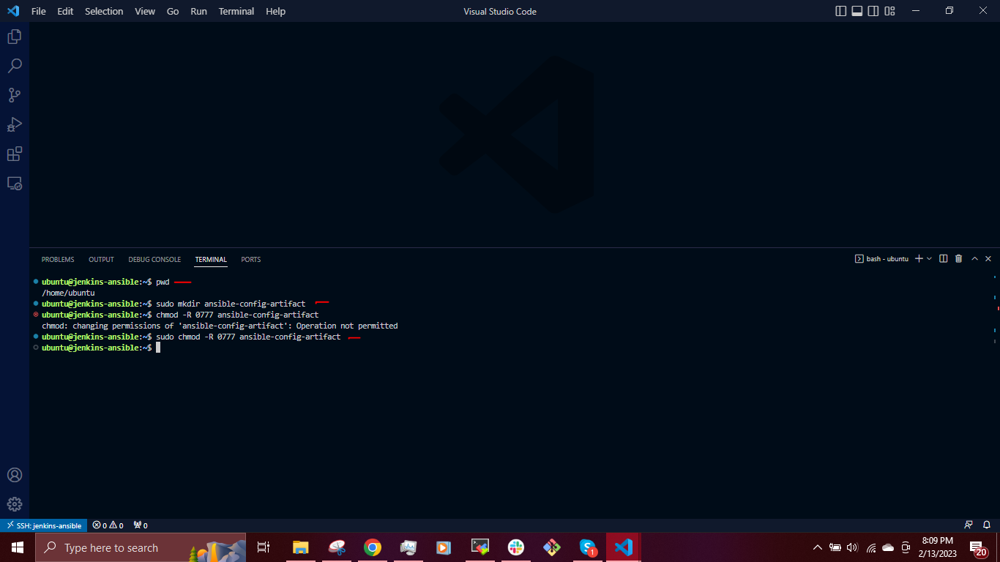

Go to Jenkins web console click on __Manage Jenkins__ then click on __Manage Plugins__.

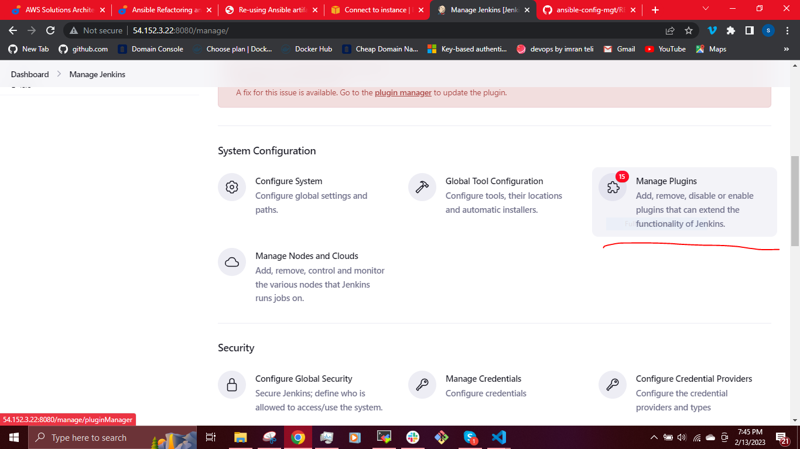

On available tab search for __Copy Artifact__ and install this plugin without restarting Jenkins.

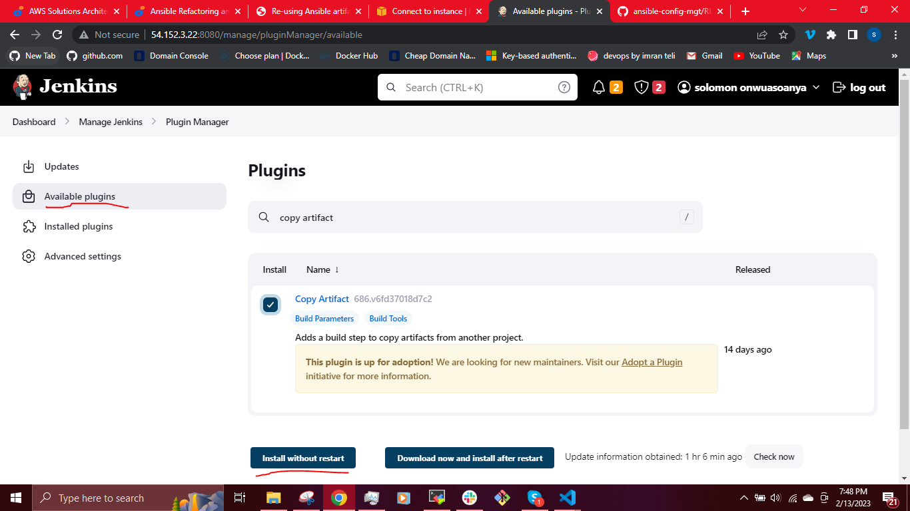

Create a new Freestyle project and name it __save_artifacts__.

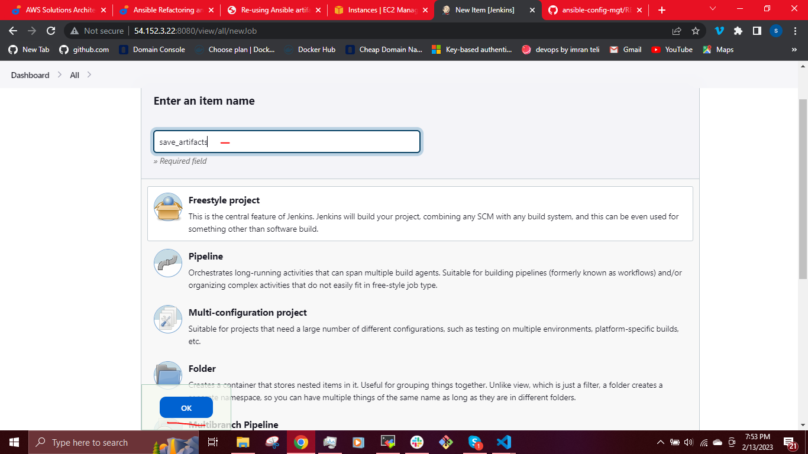

This project will be triggered by completion of your existing ansible project. Configure it accordingly:

Go to __configurations__, make the following changes.

We can configure the number of builds to keep in order to save space on the server. In this project we want to keep the last 2 builds.

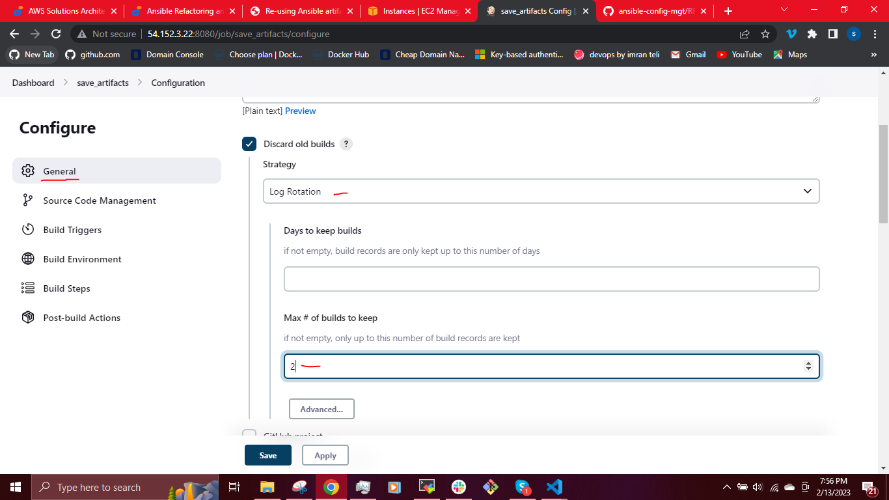

We update the __Source Code Management__ section.

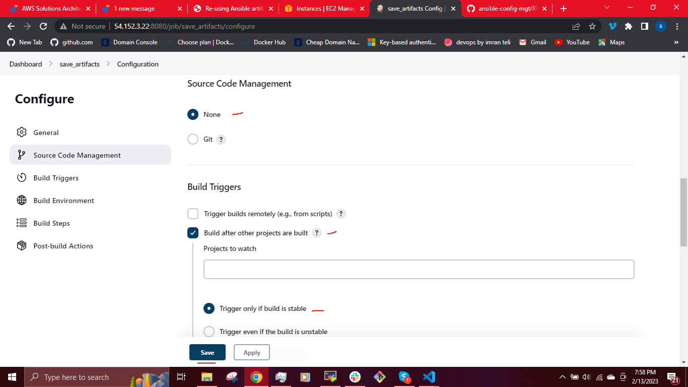

The main idea of __save_artifacts__ project is to save artifacts into __/home/ubuntu/ansible-config-artifact__ directory. 
To achieve this, we will create a __Build step__ and choose Copy artifacts from our previous __ansible__ project. We will specify __ansible__ as a source project and __/home/ubuntu/ansible-config-artifact__ as a target directory.

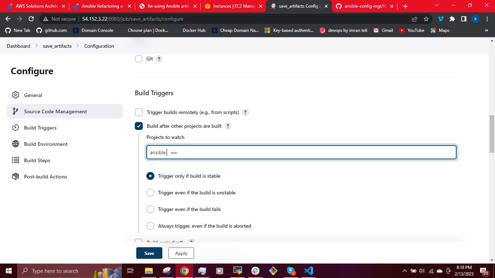
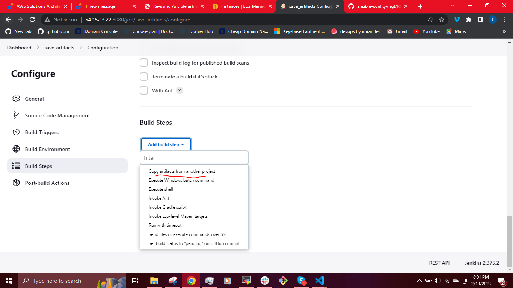
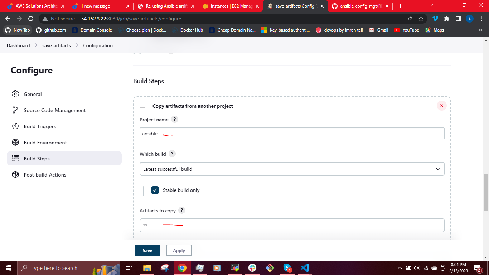
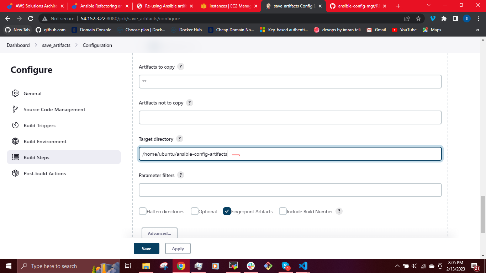

Then click on __apply__ and __save__.

Test this setup, we will be making some changes in the __README.MD__ file inside the __ansible-config-mgt__ repository.


The __save_artifacts__ build in the Jenkins

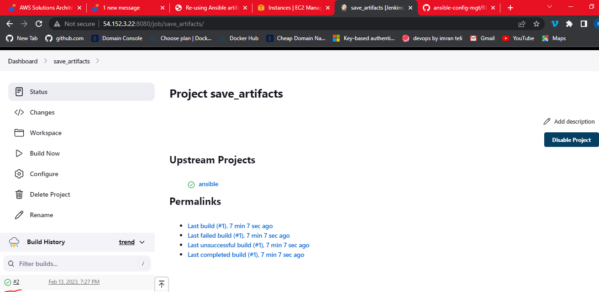

If the Jenkins jobs was completed, we will see our files inside __/home/ubuntu/ansible-config-artifact__ directory and it will be updated with every commit to the __main branch__.


__REFACTOR ANSIBLE CODE BY IMPORTING OTHER PLAYBOOKS INTO SITE.YML__

Before starting to refactor the code, We pull down the latest code from main branch and creat a new branch __refactor__.

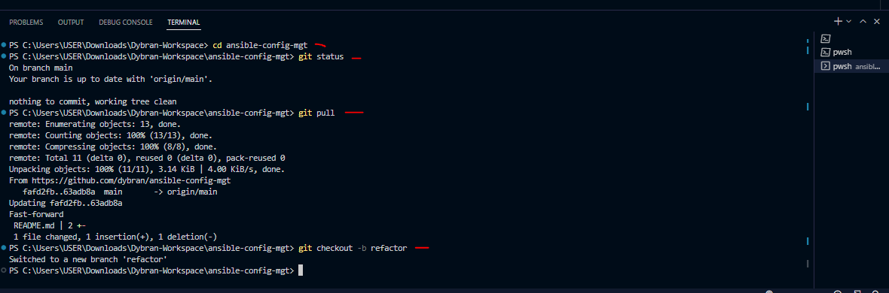

Refactoring is one of the techniques that can be used for constant iterative improvement for better efficiency in DevOps. 

In [Project-11](https://github.com/dybran/Project-11/blob/main/project-11.md), all the tasks are written in a single playbook __common.yml__. These are pretty simple set of instructions for only 2 types of OS.
In a case where we have many more tasks and we need to apply this playbook to other servers with different requirements, We will have to read through the whole playbook to check if all tasks written there are applicable and to check if there is anything that needs to be added for certain server/OS families. This will become a tedious exercise and the playbook will become messy which will make it difficult for your colleagues to use your playbook.

Breaking tasks up into different files is an excellent way to organize complex sets of tasks and reuse them.

Within  the __playbooks__ directory, create a new file and name it __site.yml__. This file will be an entry point into the entire infrastructure configuration. Other playbooks will be included here as a reference.

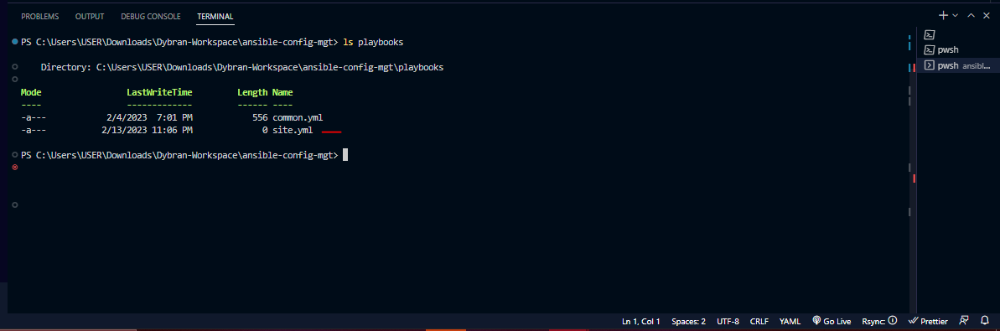

Create a new directory withing the __ansible-config-mgt__ directory and name it __static-assignment__. The __static-assignment__ directory is where all other children playbooks will be stored.

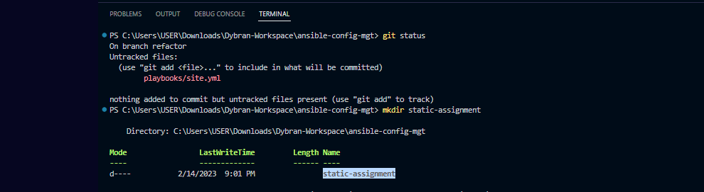

Move __common.yml__ file into the newly created __static-assignment__ directory.

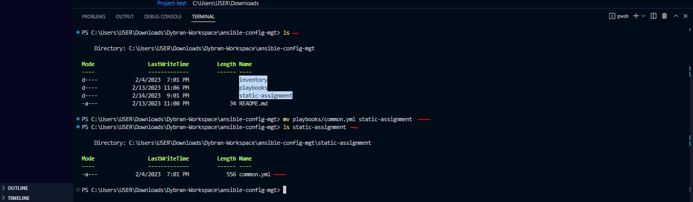

Inside __playbooks/site.yml__ file, import __common.yml__ playbook.

```
---
- hosts: all
- import_playbook: ../static-assignments/common.yml
```
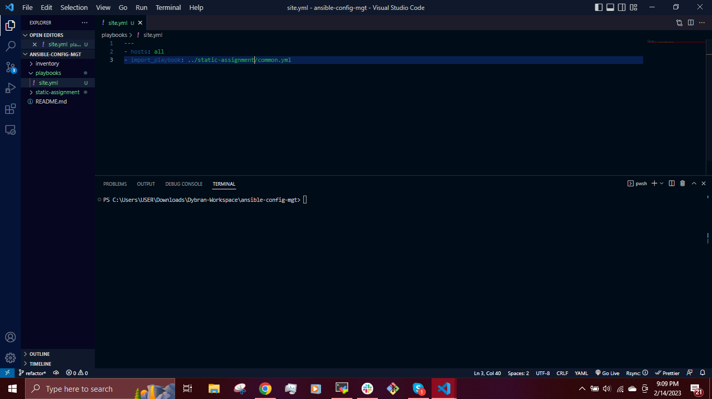

Run __ansible-playbook__ command against the __inventory/dev.yml__ environment

`$ ansible-playbook playbooks/site.yml -i inventory/dev.yml`

Since you need to apply some tasks to the development servers and __wireshark__ is already installed (in [project-11](https://github.com/dybran/Project-11/blob/main/project-11.md)). 
We will create another playbook in the __static-assignment__ and name it __common-del.yml__. 

We will configure this playbook to delete wireshark utility.

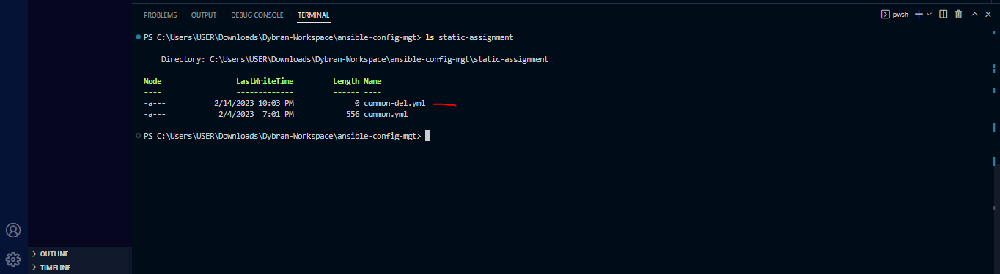

In the __static-assignment/common-del.yml__ we paste the snippet

```
---
- name: update web, nfs and db servers
  hosts: webservers, nfs, db
  remote_user: ec2-user
  become: yes
  become_user: root
  tasks:
  - name: delete wireshark
    yum:
      name: wireshark
      state: removed

- name: update LB server
  hosts: lb
  remote_user: ubuntu
  become: yes
  become_user: root
  tasks:
  - name: delete wireshark
    apt:
      name: wireshark-qt
      state: absent
      autoremove: yes
      purge: yes
      autoclean: yes
```

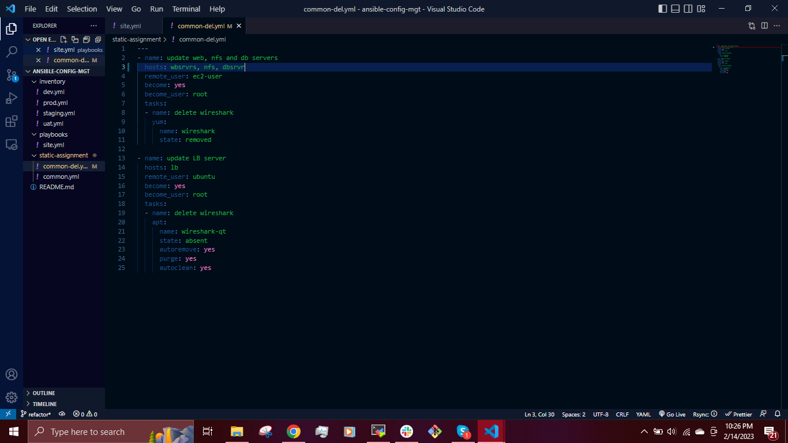

Update __playbooks/site.yml__ with the following snippet replacing __common.yml__ with __common-del.yml__.

```
---
- hosts: all
- import_playbook: ../static-assignments/common-del.yml
```
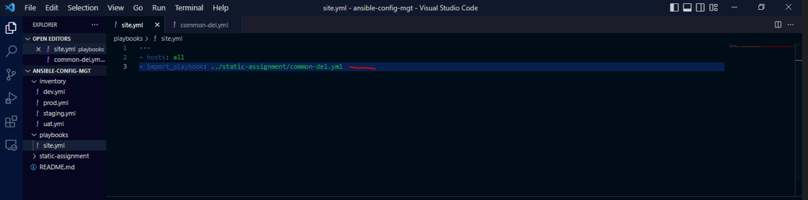

To push the codes to github and merge to the main branch

We run the commands

`$ git status`

`$ git add .`

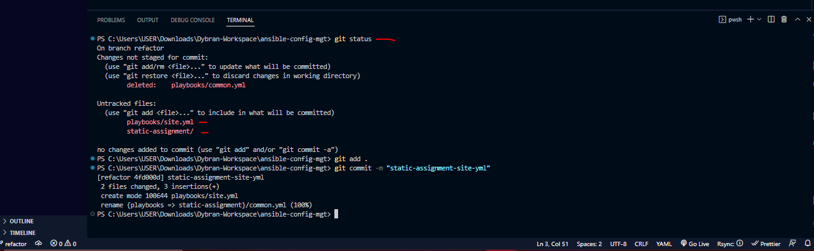

then 

`$ git commit -m "<commit-message>"`

then 

`$ git push origin refactor`

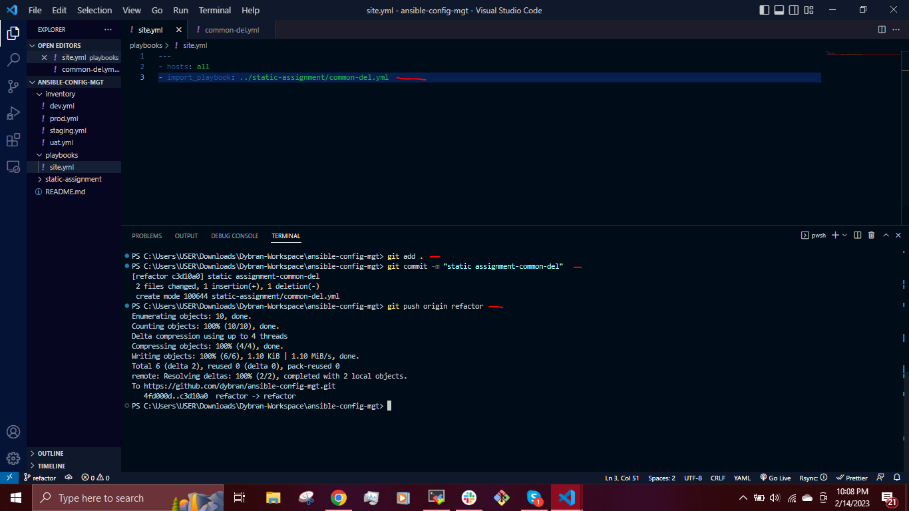


We then go to the github and create a __pull request__

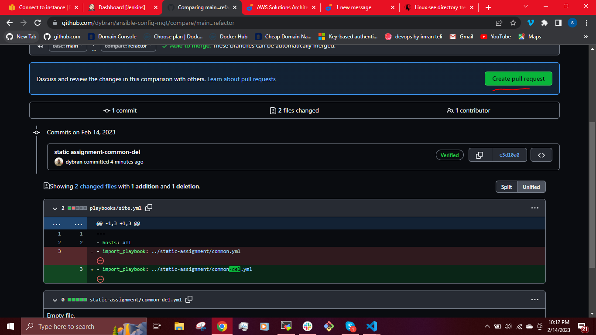

Merge to the __main branch__

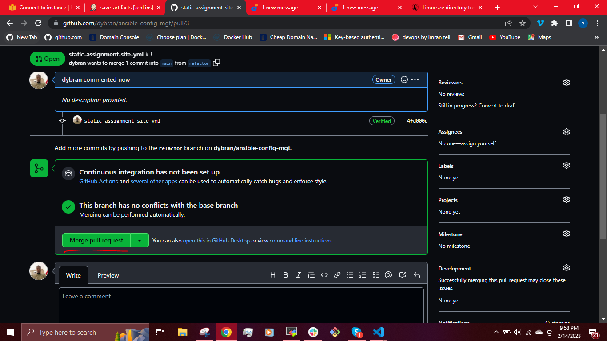

We can see the Jenkins build as soon as the code is merged to the main branch

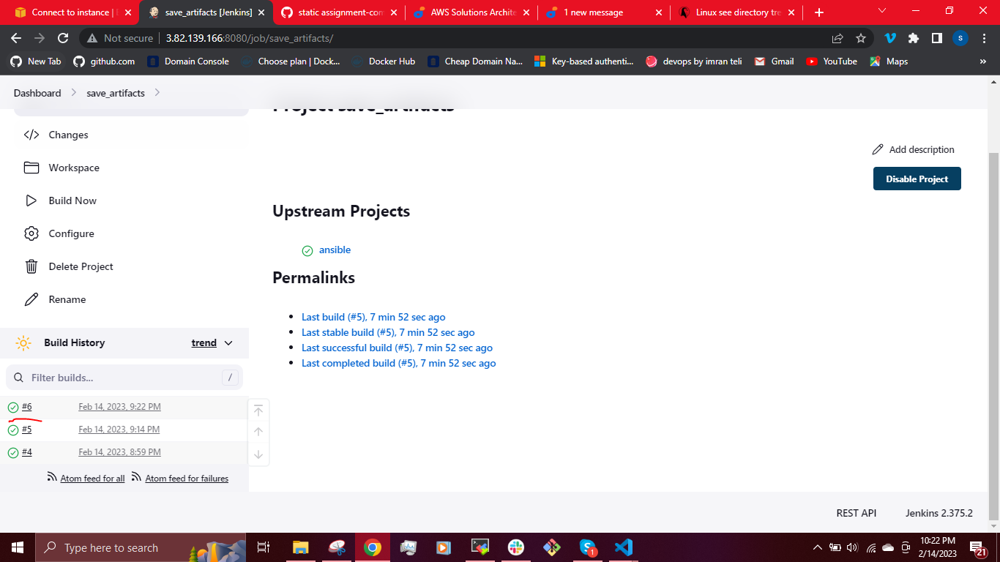

The artifact is saved in the __ansible-config-artifact__ directory in the jenkins server.

Then  run the playbook

`$ ansible-playbook -i ansible-config-artifact/inventory/dev.yml ansible-config-artifact/playbooks/site.yaml`

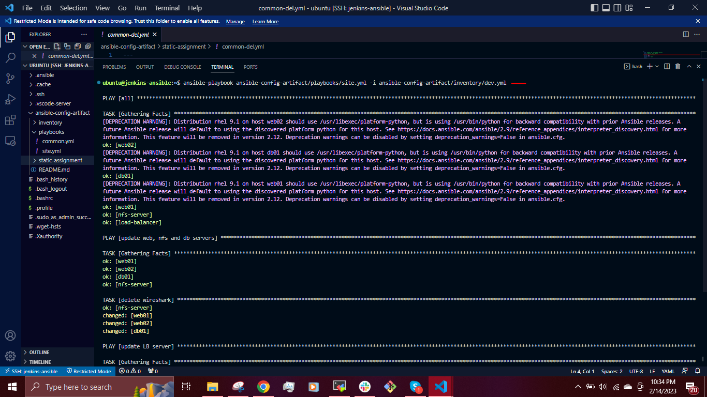

To check that wireshark is deleted on all the servers, we run the comand

`$ wireshark --version`

on the various target servers.

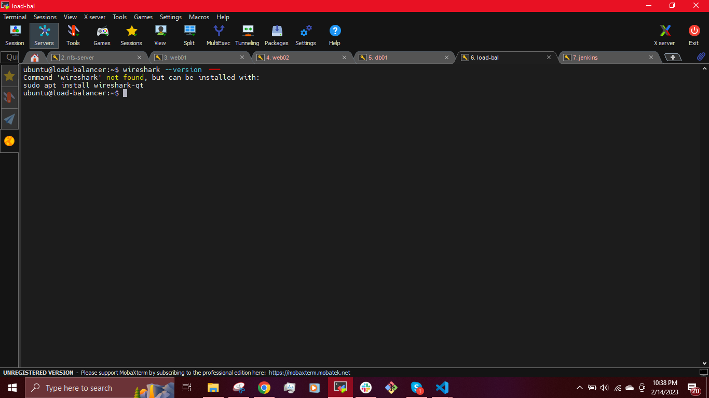

Now we have  have a ready solution to install/delete packages on multiple servers with just one command.

__CONFIGURE UAT WEBSERVERS WITH A ROLE ‘WEBSERVER’__

We will be configuring two new Web Servers as __uat__. We could write tasks to configure Web Servers in the same playbook, but it would be too messy, instead, we will use a dedicated role to make our configuration reusable.

Let us Launch two EC2 instances using RHEL 8 image, we will use them as our uat servers – __Web01-uat__ and __Web02-uat__.

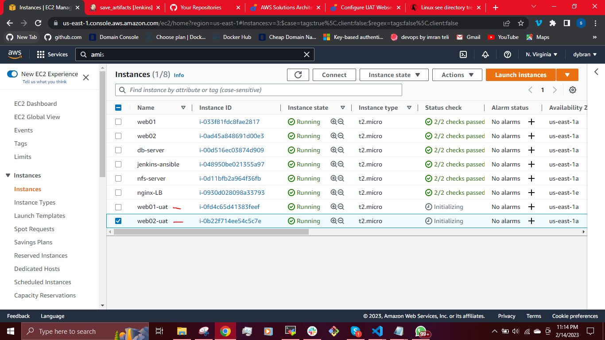

__Note:__ power off all other instances not in use to avoid extra cost. We are just going to be using the Jenkins server and the UAT webservers for this section.

Create a role directory in the __ansible-config-mgt__

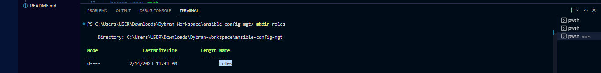

We edit the __roles path__

`$ sudo vi /etc/ansible/ansible.cfg`

Then search for __roles path__


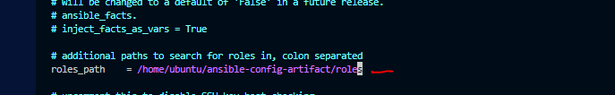

We will install [windows Subsystem for Linux(WSL)](https://learn.microsoft.com/en-us/windows/wsl/install). So we are able to access the windows files in the linux environment.

Open powershell and run as administrator

run

`wsl --install`

then on the WSL ubuntu environment run the command to connect to vscode.

`code .`

To access files on the windows machine, 
on the vscode that comes up, open a terminal and __"cd /mnt/"__

Then __"cd"__ into __"c"__ ans access the __"ansible-config-mgt"__ directory.


Install ansible in the __ansible-config-mgt__

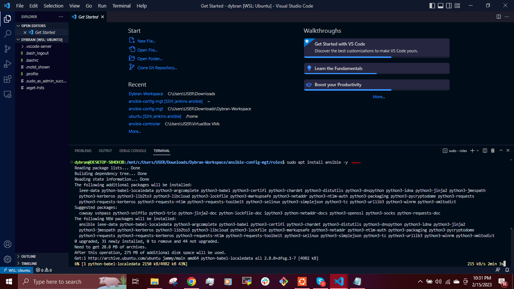

In the roles directory, create the __webserver__ role.

`$ cd roles`

`$ ansible-galaxy init webserver`


To install tree

`$ sudo apt install tree -y`


__N/B:__ We can create the webserver role manually if we choose to.

The entire directory structure should look like below after removing unnecessary directories and files

`$ tree webserver`

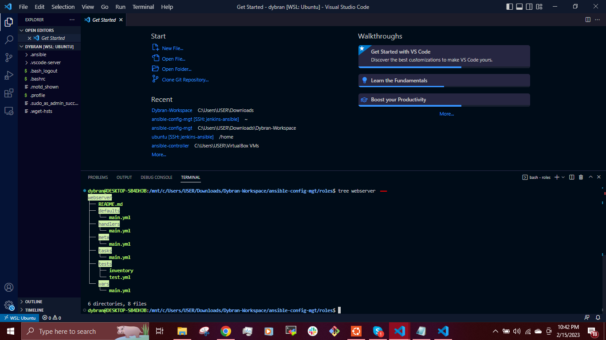

Update the inventory __ansible-config-mgt/inventory/uat.yml__ file with IP addresses of your 2 UAT Web servers

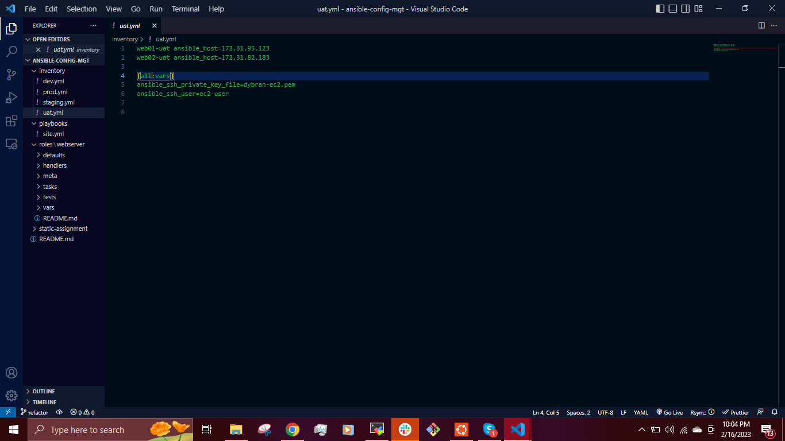

Update the jenkins __/etc/hosts__ directory with the UAT webservers.

`$ sudo vi /etc/hosts/`

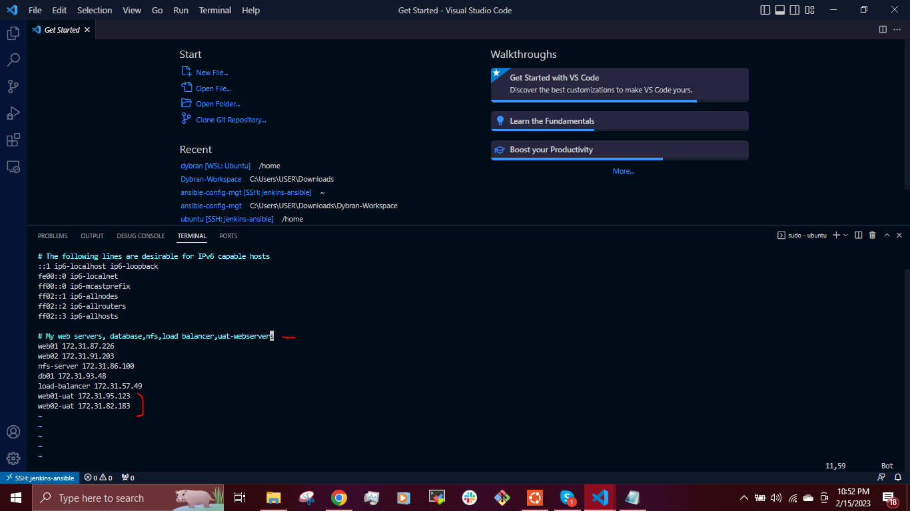

Check for connectivity to the uat-webservers

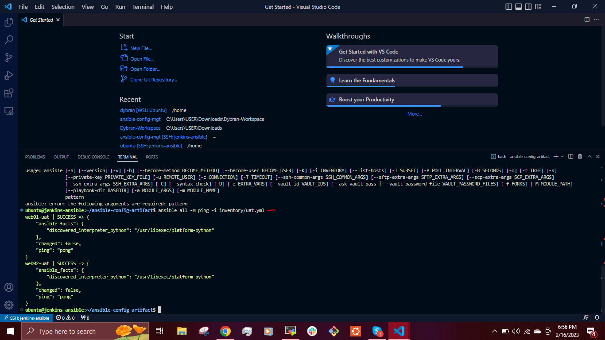

Go to __/etc/ansible/ansible.cfg__ and update


Go into __tasks__ directory, and within the __main.yml__ file, start writing configuration tasks to do the following:

- Install and configure Apache (httpd service)
- Clone Tooling website from GitHub https://github.com/dybran/tooling.git.
- Ensure the tooling website code is deployed to /var/www/html on each of 2 UAT Web servers.
- Make sure httpd service is started.

```
---
- name: install apache
  become: true
  ansible.builtin.yum:
    name: "httpd"
    state: present

- name: install git
  become: true
  ansible.builtin.yum:
    name: "git"
    state: present

- name: clone a repo
  become: true
  ansible.builtin.git:
    repo: https://github.com/<your-name>/tooling.git
    dest: /var/www/html
    force: yes

- name: copy html content to one level up
  become: true
  command: cp -r /var/www/html/html/ /var/www/

- name: Start service httpd, if not started
  become: true
  ansible.builtin.service:
    name: httpd
    state: started

- name: recursively remove /var/www/html/html/ directory
  become: true
  ansible.builtin.file:
    path: /var/www/html/html
    state: absent
```

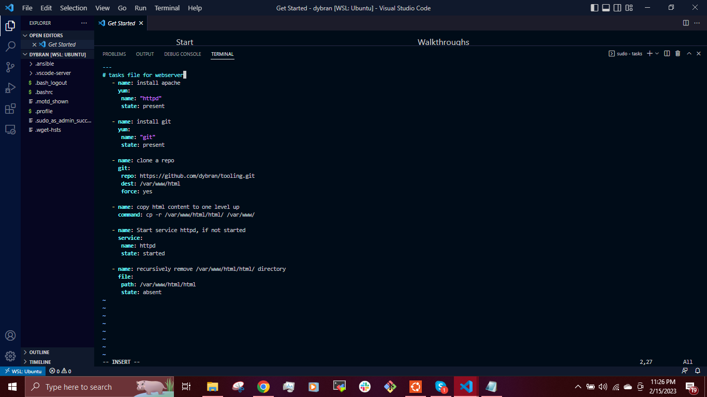

__REFERENCE WEBSERVER ROLE__

Within the __static-assignment__ directory, create a new assignment for uat-webservers __uat-webservers.yml__. This is where we will reference the role.

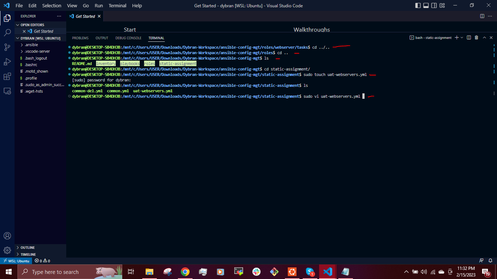

Update the __uat-webservers.yml__ file

```
---
- hosts: all
  roles:
     - webserver
```

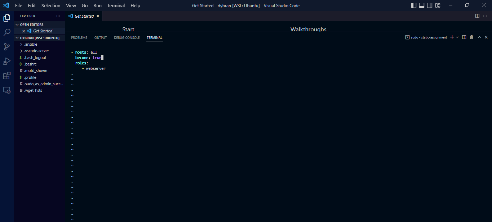

Update the __playbooks/site.yml__ which is the entry point to our ansible configuration. Therefore, you need to refer the __uat-webservers.yml__ role inside __site.yml__.

```
---
- hosts: all
- import_playbook: ../static-assignments/common-del.yml

- hosts: all
- import_playbook: ../static-assignments/uat-webservers.yml
```

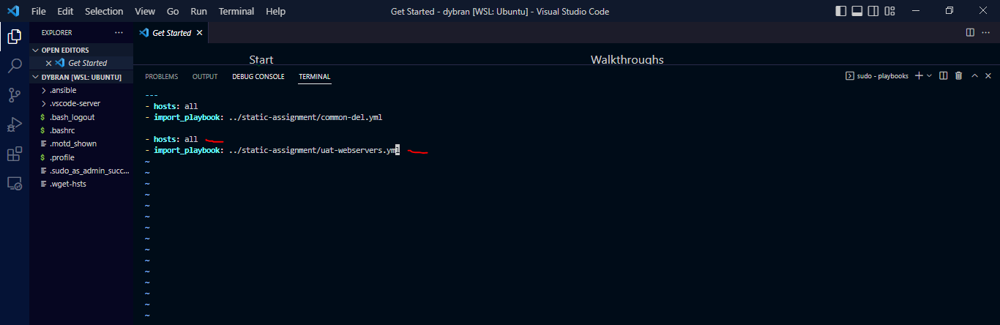


__COMMIT AND TEST__

Commit the changes, create a Pull Request and merge them to main branch, make sure webhook triggered two consequent Jenkins jobs, they ran successfully and copied all the files to your Jenkins-Ansible server into /home/ubuntu/ansible-config-mgt/ directory.

Push to the github reepository __refactor__ branch

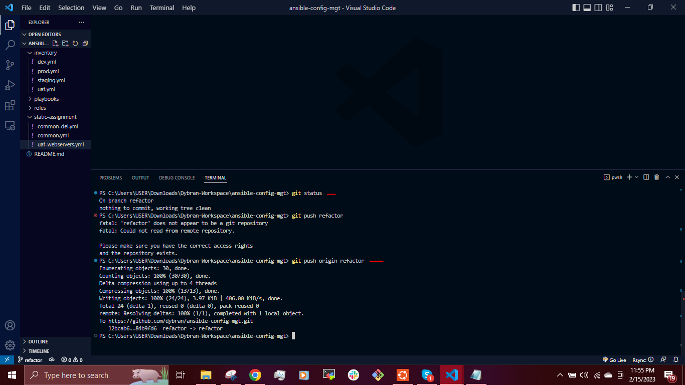

Create a pull request

then merge to __main__ branch

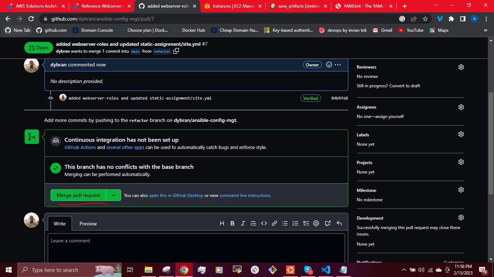

The Jenkins builds automatically.

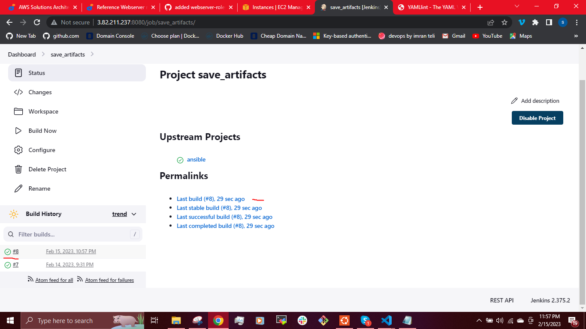

Then saves the artifact in the __ansible-config-artifact__ Jenkins server.

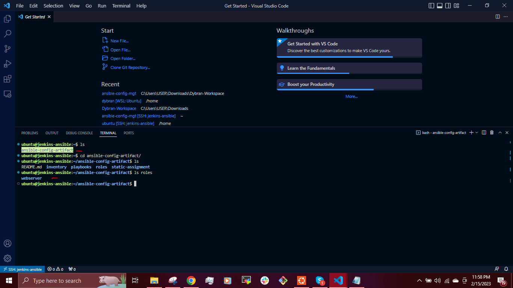

Now we run the playbook

`$ ansible-playbook -i /ansible-config-artifact/inventory/uat.yml /ansible-config-artifact/playbooks/site.yml`

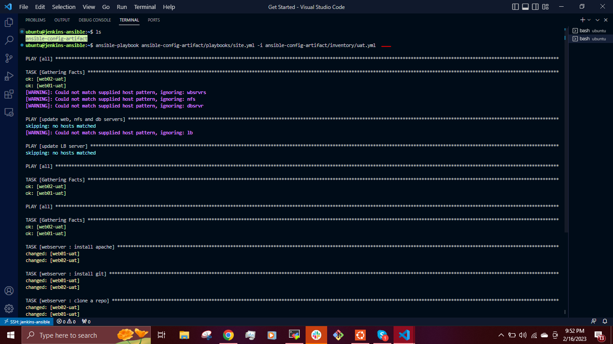

We should be able to see both of the UAT Webservers configured and can reach them from the browser:

`http://<Web01-UAT-Server-Public-IP-or-Public-DNS-Name>/index.php`


The Ansible architecture now looks like this


We just deployed and configured UAT Web Servers using Ansible imports and roles.


